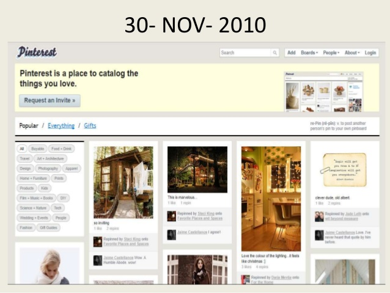

# Exercise #4: Mood Board

5 points

**DUE: Wednesday, February 10 by 1:50pm**

### Instructions

For this exercise, we'll put together all the techniques we covered this week to
make an interactive web page to build a collection of images related to a
theme—a [mood board](https://en.wikipedia.org/wiki/Mood_board).

Create a page that starts with an empty board and prompts users to enter a
search query. Use an image search API to fetch images matching that query and
present them to the user. Let users select images from the result set to be
placed on their board (by adding them to the DOM). Keep those images on the
board and allow users to keep running searches and adding more images.

There are free image search APIs available from [Shutterstock](https://www.shutterstock.com/api/pricing)
and [Bing](https://azure.microsoft.com/en-us/services/cognitive-services/bing-image-search-api/),
but feel free to use any you find useful.

Once the user has started a search, use an API to suggest related searches they
could run too. Make the results clickable, such that clicking them runs the
suggested search. Microsoft offers a straightforward [Search Suggestion API](https://concept.research.microsoft.com/Home/API), but feel free to use any you find useful.

Use your judgment to make a functional and visually appealing page. You may want
to consider using some of the advanced layouts we learned in Week 2 to fit the
control elements, search results, and selected images onto the page in an
attractive way.

Don't worry about saving mood boards once they've been created; this week we'll
embrace ephemerality.

Remember to include in your submission any classmates you collaborated with and
any materials you consulted.

### Rubric

1 point each for:
- Query for images and display results
- Add selected images to board
- Query for related concepts and display results
- Run searches with related concepts
- Usable and visually appealing
